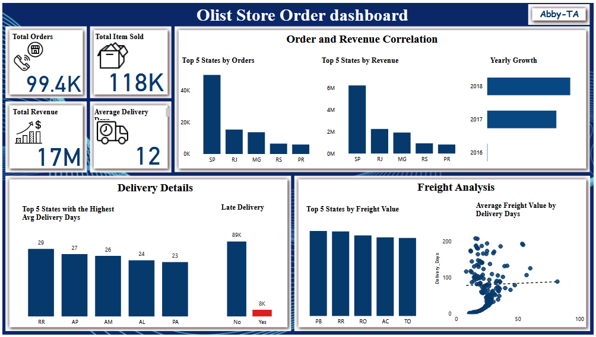
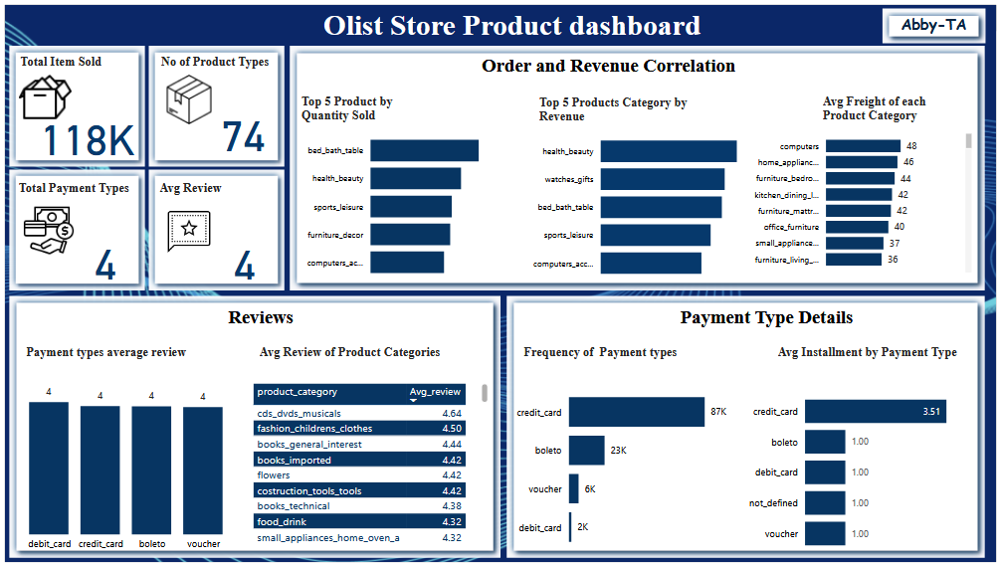

# 🛒 Olist Store Dashboards

This repository contains two interactive dashboards analyzing **Olist Store** data — an e-commerce platform that connects small Brazilian businesses to online shoppers.  
The dashboards explore **sales performance, delivery efficiency, freight analysis, product trends, customer satisfaction,** and **payment behaviors**.

---

## 🧠 Project Description

**Goal:**  
To generate actionable insights from Olist’s e-commerce dataset and identify trends that can improve **sales, delivery performance, and customer experience**.

**Dataset Summary:**  
The dataset includes detailed records of:
- **Orders:** Order IDs, customer IDs, purchase timestamps, delivery details, and freight values.  
- **Products:** Category, weight, dimensions, photos, and descriptions.  
- **Payments:** Payment types, installments, and total transaction amounts.  
- **Reviews:** Customer feedback and ratings for each completed order.  
- **Geolocation:** City, state, and zip code mappings for customers and sellers.

**Tools Used:**  
- 🧩 **Power BI** – Data visualization and dashboard design  
- 🧮 **Excel** – Data cleaning and transformation  
- 🗄️ **SQL** – Querying and summarizing transactional data  
- 🖥️ **GitHub** – Documentation and version control  

---

## 📊 Dashboards Overview

### 🧾 1. Olist Store **Order Dashboard**

**Purpose:**  
To monitor order distribution, delivery timelines, revenue contribution, and freight value across different Brazilian states.

### 📦 2. Olist Store **Product Dashboard**

**Purpose:**  
To analyze product sales performance, category profitability, customer satisfaction, and payment preferences.

---

## 🚨 Business Problems Identified

1. **High Delivery Delays:** Around 8% of orders are delivered late, with an average delivery time of **12 days**.  
2. **Regional Imbalance:** Orders and revenue are highly concentrated in **São Paulo (SP)** and **Rio de Janeiro (RJ)**.  
3. **Freight Inefficiency:** Freight cost doesn’t correlate with faster delivery times — indicating logistic inefficiency.  
4. **Uneven Product Performance:** Only a few product categories dominate sales and revenue.  
5. **Limited Payment Adoption:** Overreliance on **credit cards** (87K transactions) compared to other methods.

---

## 🎯 Dashboard Objectives

### **Order Dashboard**
- Track **total orders, revenue, and delivery performance** across states.  
- Identify **top-performing regions** by orders, freight, and revenue.  
- Analyze **late deliveries** and **freight correlation** to improve logistics.  
- Visualize **year-on-year growth** trends for business expansion.  

### **Product Dashboard**
- Evaluate **product performance** by quantity sold and revenue generated.  
- Assess **customer satisfaction** through review scores.  
- Compare **payment method frequency and installment trends**.  
- Examine **freight cost variation** across product categories.  

---

## 🔍 Insights Generated

### 🧾 **Order Dashboard Insights**
- **SP (São Paulo)** leads in both orders and revenue, making it the top-performing region.  
- **Average delivery time:** 12 days; remote states (RR, AP, AM) have the longest delivery averages (26–29 days).  
- **Late Deliveries:** 8K orders (~8%) were delivered late.  
- **Freight Analysis:** Higher freight values don’t translate into shorter delivery durations.  
- **Growth Trend:** Significant increase in order and revenue from **2017 to 2018**, indicating strong business expansion.

### 📦 **Product Dashboard Insights**
- **Top Selling Products:** *Bed Bath Table* and *Health Beauty* categories dominate in sales and revenue.  
- **Highest Rated Categories:** *CDs/DVDs/Musicals* and *Fashion Children’s Clothes* have reviews above 4.5/5.  
- **Freight Costs:** *Computers* and *Home Appliances* have the highest average freight (≈48–46).  
- **Payment Distribution:** Credit card dominates (87K) with average installment plan of **3.5x**.  
- **Customer Review Average:** Consistent **4/5 rating** across all payment types, indicating steady satisfaction.

---

## 💡 Recommendations

1. **Optimize Logistics:**  
   Improve delivery efficiency for distant states (RR, AP, AM) to reduce average delivery days and late deliveries.  

2. **Diversify Market Reach:**  
   Expand targeted campaigns in low-performing regions to reduce dependence on SP and RJ.  

3. **Reassess Freight Model:**  
   Align freight pricing with delivery performance and explore partnerships with faster logistics providers.  

4. **Broaden Product Focus:**  
   Promote well-rated but low-revenue categories (Books, Flowers) through discounts or visibility campaigns.  

5. **Encourage Payment Variety:**  
   Offer small incentives (e.g., cashback or discounts) for using alternative payment methods such as Boleto or Debit Card.  

---

## 🧭 Conclusion

The Olist Store dashboards reveal a **strongly growing e-commerce platform** with solid sales and customer satisfaction.  
However, key opportunities lie in:
- Reducing delivery delays,  
- Optimizing freight operations, and  
- Expanding both product and payment diversity.  

> 📈 Implementing these recommendations will improve operational efficiency, enhance customer trust, and sustain business growth across all regions.

---

**Author:** Abby-TA  
**Project:** Olist Store Data Analytics Challenge  
**Tools Used:** Power BI | Excel | GitHub  

---
